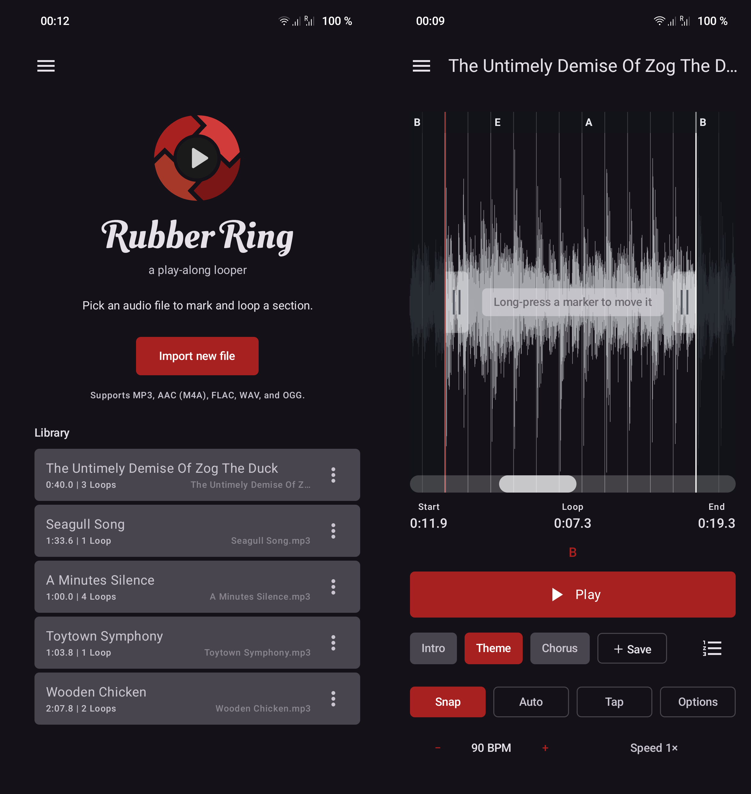

<h1>
  
  RubberRing
</h1>

An Android tool for practicing song parts. Pick an audio file, mark a start/stop region on its waveform, and play it back in a seamless, gapless loop. RubberRing auto-detects (to some extend) tempo and beats to snap the loop markers to a beat grid, with full manual override.

**Alpha software.** Early access chaos — a bold choice.

## Screenshot



## Features

- **Import-and-own library** — picked files are copied into app-private storage, so
  loops never break when the original is moved, renamed, or deleted.
- **Waveform region selection** — drag start/stop handles to mark the section to loop.
- **Gapless looping** — the selected region is decoded to PCM and looped via
  `AudioTrack` loop points, so the boundary wraps with zero audible gap or click.
- **Automatic beat grid** — a dependency-free tempo estimator (onset-flux
  autocorrelation with a comb filter) finds BPM and a downbeat; the grid is always
  hand-editable.
- **Snap to grid** — drag handles snap to the quarter-note beat grid.
- **Downbeat = start** — re-anchors the grid so a beat line falls exactly on the
  current loop-start marker. Auto-detect usually nails the tempo but can be a fraction
  of a beat off in phase; put the start handle on a beat and tap this to lock the whole
  grid to it.
- **Saved loops** — capture a region + grid per track and restore it later.

## Tech stack

- **Language:** Kotlin (Java 17 target)
- **UI:** Jetpack Compose (Canvas for the waveform, grid, and handles)
- **Build:** Android Gradle Plugin 9.2.1 + Gradle 9.5.1 (via wrapper)
- **SDK:** `minSdk` 26 · `compile`/`targetSdk` 36
- **Decode:** `MediaExtractor` + `MediaCodec` → PCM
- **Playback:** low-level `AudioTrack` with sample-accurate loop points
- **Beat detection:** custom, no native/NDK or GPL dependencies
- **Async:** Kotlin Coroutines + Flow

## Building

Requires a JDK (17+) and the Android SDK. Point the build at your SDK by creating a
`local.properties` file in the project root (this file is git-ignored):

```properties
sdk.dir=/path/to/Android/Sdk
```

Then build a debug APK:

```sh
./gradlew assembleDebug
```

The APK lands at `app/build/outputs/apk/debug/app-debug.apk`; sideload it to a device
to run it.

## Project layout

```
app/src/main/java/de/singular/looper/
  MainActivity.kt        Compose entry point
  LooperViewModel.kt     app state, orchestrates decode / detect / play
  audio/
    AudioDecoder.kt      file URI -> PCM + metadata
    LoopPlayer.kt        AudioTrack wrapper: loop points, play/pause/seek
    BeatDetector.kt      tempo + downbeat estimation
    DecodedAudio.kt / WaveformData.kt   PCM + envelope models
  library/
    LibraryRepository.kt import-and-own storage + metadata index
    LibraryTrack.kt / SavedLoop.kt
  ui/
    LoopWaveform.kt      waveform + grid + handle rendering
```

## Disclaimer

This project was developed with AI assistance. The code has been analysed with Codacy (detekt). Use at your own discretion.  

[](https://app.codacy.com/gh/mkay/RubberRing/dashboard)
